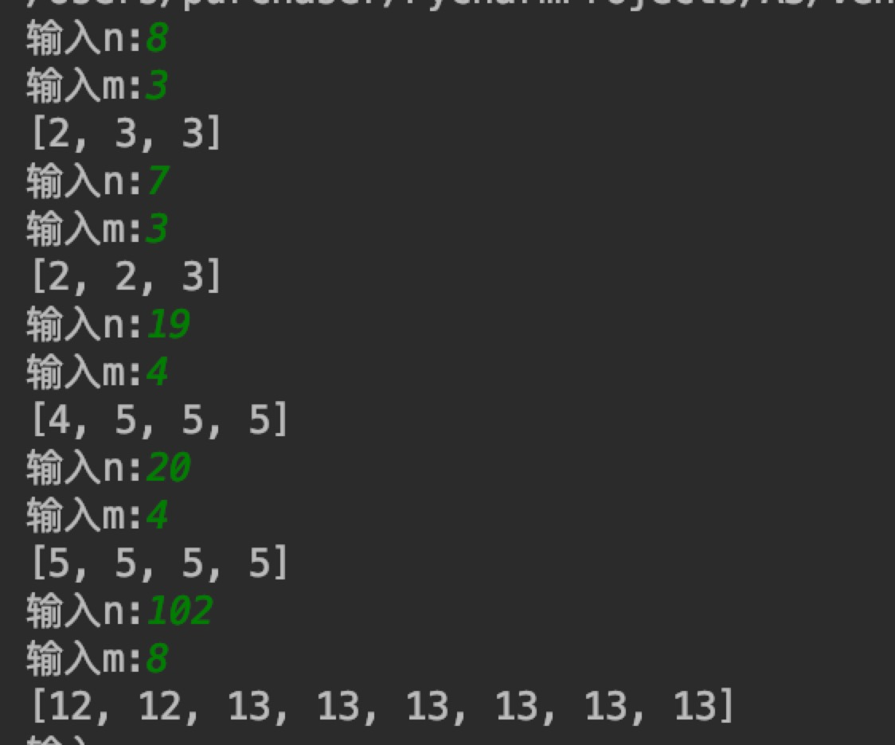

# 算法作业 A3 编程题
## 题目
给你一根长度为 n 的绳子，请把绳子剪成 m 段(m，n 都是整数，n>1 并且 m>1)， 每段绳子的长度记为 k[0], k[1], ..., k[m]。请问 k[0] k[1] ... k[m]可能的最大乘积是多少?例 如，当绳子的长度是 8 时，我们把它剪成长度分别为 2，3，3 的三段，此时得到的最大乘积 是 18。

## 语言
python 3.7

## 使用方法
使用python运行main.py文件
```
python main.py
```
即可

## 算法思路
- 根据数学知识，将一个数拆分成多个数，再乘积。在这些数相等时，结果会最大。但是题目要求只能拆分成整数，所以结果中应该只有两种数，其中一个比另一个大1。根据贪婪的思想，我们应该让较大的那个数最多。根据数学推算，n除以m所得的余数，即应为较大的数的个数，较小的数的个数应由前者推出。其中
   - 较小的数 为：n // m
   - 较大的数 为：n // m + 1
   - 较大的数的个数 为： n % m
   - 较小的数的个数 为： (n - (n % m) * (n // m + 1)) // (n // m)
- 最终结果 即为一个包含所有这些数的列表

## 截图
